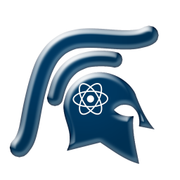

# Spartan Dev Project

The Spartan Dev Project is Game Dev Tycoon mod API system that aims to have a source written in [Coffeescript](http://coffeescript.org/) with Object Oriented script paradigms in mind, clear cut and extensive documentation, and adding much more complex and advanced features in a simplistic system, as well as wrapping around the very old yet well known modding API UltimateLib to get old mods back upto speed with very minimal work.

#### [Thread](https://forum.greenheartgames.com/t/wip-spartan-dev-project/20755)

#### [Offical Discord Server](https://discord.gg/013Nyx80lEMqpkOPO)

### Warning
This API is not complete, nor is it likely not to create problems or conflicts, use at your own risk

## Credits
[Plasma07](https://forum.greenheartgames.com/users/plasma07) on the Greenheart Games Forums for the awesome logo

#### Third Party
[jStorage](https://github.com/andris9/jStorage) from andris9

[console-control-strings](https://github.com/iarna/console-control-strings) from iarna

### Contribution Setup
In order to develop for this project, you must have coffeescript installed and readily available on your computer:

1. Install npm ([Node.js](https://nodejs.org/en/) recommended)

2. After installing npm, install coffeescript using 'npm install -g coffee-script' (if you prefer a local installation, you must manage outputting to js manually)

3. With the global install, open your terminal/cmd, go to this directory, and type 'output'

### Coming Soon
A new documentation system for Coffeescript called SpartaDoc will be an open-source release, making documenting coffeescript APIs easier (may eventually incorperate Javascript), will be akin to Doxygen in many ways